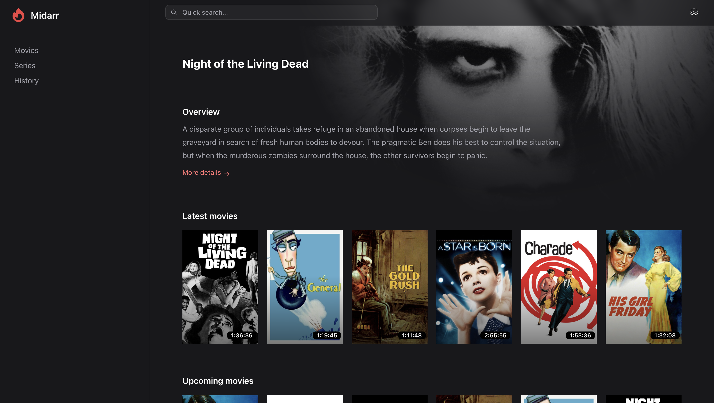
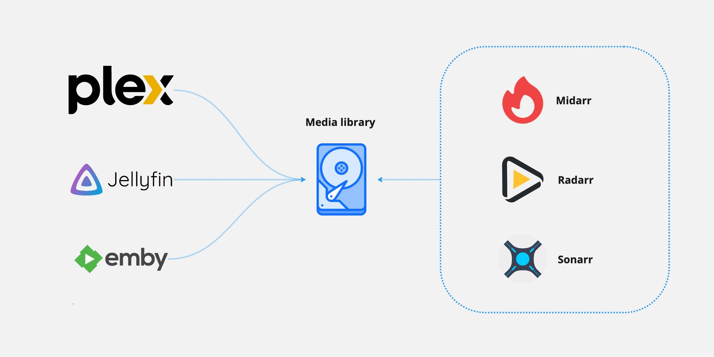
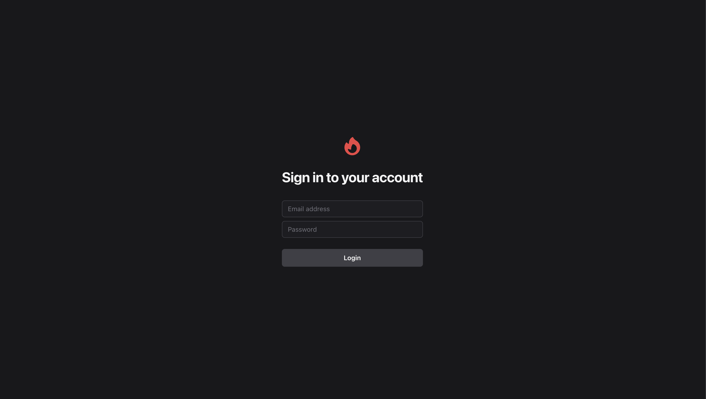
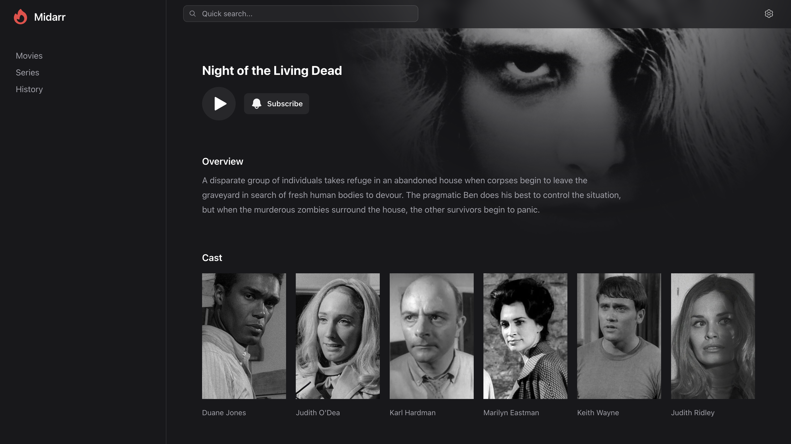
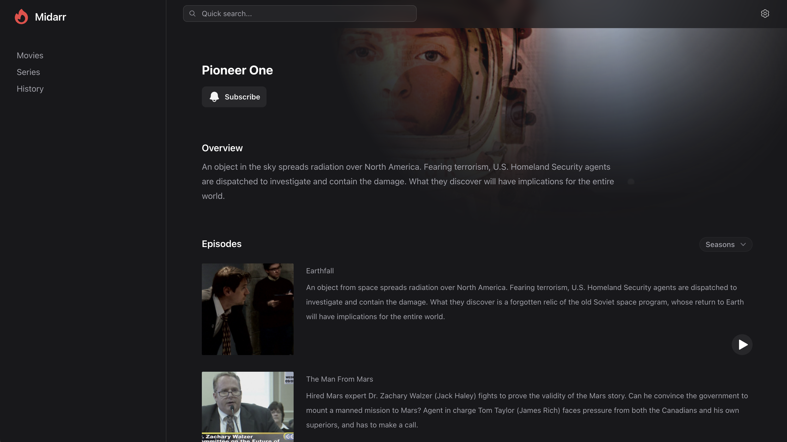

<p align="center">
    
</p>

<p align="center">
    <em>Your media enjoyed with a minimal lightweight media server</em>
</p>

<p align="center">
    <a href="https://github.com/midarrlabs/midarr-server/actions/workflows/build.yml">
        
    </a>
    <a href="https://codecov.io/gh/midarrlabs/midarr-server">
        
    </a>
    <a href="https://github.com/midarrlabs/midarr-server/blob/master/LICENSE">
        
    </a>
    <a href="https://github.com/midarrlabs/midarr-server/releases">
        
    </a>
    <a href="https://github.com/midarrlabs/midarr-server/issues?q=is%3Aopen+is%3Aissue">
        
    </a>
    <a href="https://github.com/midarrlabs/midarr-server/issues?q=is%3Aissue+is%3Aclosed">
        
    </a>
</p>

Free and open source (and always will be), **Midarr** aims to provide a tailored experience for **you** and **your**
users:

* Beautifully crafted user interface
* Real-time online statuses
* Simple and easy invite system
* Integrates with your existing services, [Radarr](https://radarr.video/) and [Sonarr](https://sonarr.tv/)



### What is this?

This is a lightweight (albeit companion) media server to the likes of Radarr and Sonarr. 
Your media is left untouched and unscathed as it is served through a simple (yet familiar) web interface that puts your media front and center for
**you** and **your** users to enjoy.

While other media solutions look to re-index, re-fetch and re-double handle your media library, Midarr simply leverages your pre-existing
services to delight and enhance **your** media experience.



### How is this lightweight?

* **Direct streaming.** Your media served fresh off the metal.
* **Smart caching.** Your media smartly kept in sync with your integrations.
* **Integrated experience.** Your media kept the way you like it.

### What else does this do?

Your media is served through a slick web interface providing:

* User authentication
* User profile settings
* User online statuses

with more features planned ahead.

## Usage

### Docker compose

```yaml
volumes:
  database-data:

services:
  
  midarr:
    container_name: midarr
    image: ghcr.io/midarrlabs/midarr-server:latest
    ports:
      - 4000:4000
    volumes:
      - /path/to/media:/media
    environment:
#       App config
      - APP_URL=http://midarr:4000

#       Database config
      - DB_USERNAME=my_user
      - DB_PASSWORD=my_password
      - DB_DATABASE=my_database
      - DB_HOSTNAME=postgresql

#       Admin account
      - SETUP_ADMIN_EMAIL=admin@email.com
      - SETUP_ADMIN_NAME=admin
      - SETUP_ADMIN_PASSWORD=somepassword # minimum length 12

#       Radarr integration
      - RADARR_BASE_URL=radarr:7878
      - RADARR_API_KEY=someApiKey

#       Sonarr integration
      - SONARR_BASE_URL=sonarr:8989
      - SONARR_API_KEY=someApiKey

    depends_on:
      postgresql:
        condition: service_healthy

  postgresql:
    container_name: postgresql
    image: postgres
    volumes:
      - database-data:/var/lib/postgresql/data
    environment:
      - POSTGRES_USER=my_user
      - POSTGRES_PASSWORD=my_password
      - POSTGRES_DB=my_database
    healthcheck:
      test: "exit 0"
```

### Admin account

To initialise this, please provide the following **environment variables**. This will allow you to configure your server at the **settings** page.

```yaml
environment:
  - SETUP_ADMIN_EMAIL=admin@email.com
  - SETUP_ADMIN_NAME=admin
  - SETUP_ADMIN_PASSWORD=somepassword # minimum length 12
```

### Invite system

To send invitations, please provide the following **environment variables**. Access the **settings** page to invite users to your server.

```yaml
environment:
  - APP_MAILER_FROM=example@email.com
  - SENDGRID_API_KEY=someApiKey
```

### OIDC / OAuth 2.0

To use your own identity provider like [Authentik](https://goauthentik.io/), please provide the following **environment variables**. Go to `/auth` to initiate the auth flow.

```yaml
environment:
  - OAUTH_CLIENT_ID=someClientId
  - OAUTH_CLIENT_SECRET=someClientSecret
  - OAUTH_ISSUER_URL=http://some-provider.url
  - OAUTH_AUTHORIZE_URL=http://some-provider.url/authorize
  - OAUTH_TOKEN_URL=http://some-provider.url/token
  - OAUTH_REDIRECT_URI=http://some-provider.url/auth/callback
  - OAUTH_USER_URL=http://some-provider.url/user
```


## Support

### Videos

* H.264 / H.265 codec
* AAC / MP3 audio
* MP4 / MKV container

### Subtitles

A single **.srt** file in the root directory of the video is currently supported. With this setup a subtitle / caption option will be available in the player view.

```
library/video
          └──video.srt
          └──video.mp4
```

## FAQ

### Why won't my media play?

Midarr looks to your integrations to resolve your media locations. Midarr **is not** aware of where your media lives!
A common way to mount a media library is to mount the root directory where both movies and series reside:

```yaml
services:

  midarr:
    volumes:
      - /path/to/media:/media

  radarr:
    volumes:
      - /path/to/media:/media

  sonarr:
    volumes:
      - /path/to/media:/media
```

### Why won't my media sync?

To keep your media in sync, webhook urls are required in your integrations. Midarr accepts a
POST request from your integrations with your unique API Token (found on the Midarr Settings page).

Add these webhook urls to Radarr / Sonarr under `Settings -> Connect -> Webhook`:

#### Radarr example
```
http://midarr:4000/api/webhooks/movie?token=some-api-token
```

#### Sonarr example
```
http://midarr:4000/api/webhooks/series?token=some-api-token
```


### What integrations does this support?

We support the following integration versions:

* Radarr `v5.x`
* Sonarr `v3.x`

## Contributing

Thank you for all your contributions! Big or small - all is welcome!

### Local development

1. Fork and git clone the repository

```
git clone https://github.com/{ YOUR-ACCOUNT }/midarr-server.git
```

2. Docker compose up the stack

```
cd midarr-server && docker compose up -d
```
3. Service locations:

- [http://localhost:4000](http://localhost:4000) - Midarr
- [http://localhost:7878](http://localhost:7878) - Radarr
- [http://localhost:8989](http://localhost:8989) - Sonarr

## License

Midarr is open-sourced software licensed under the [MIT license](LICENSE).

## Preview




