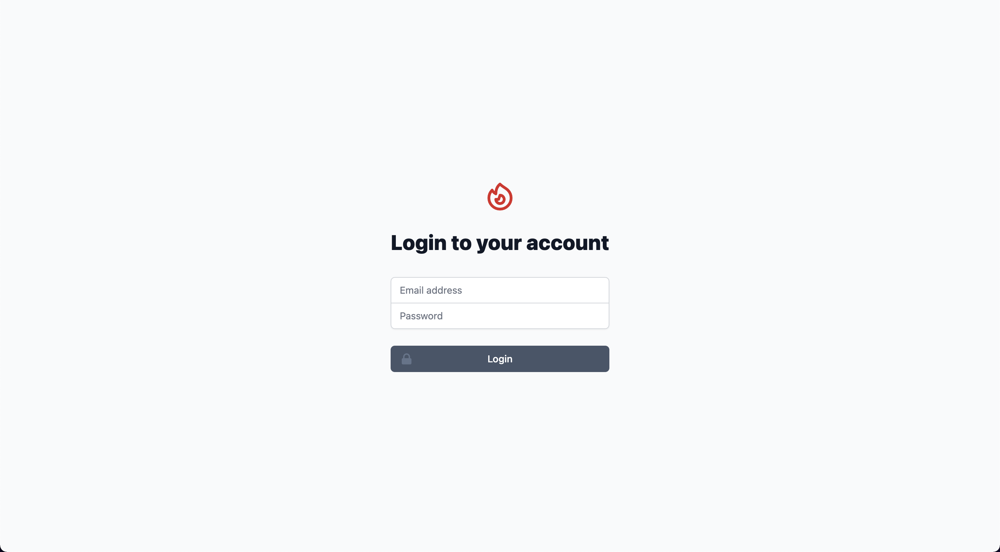

<p align="center">
    
</p>

<p align="center">
    <a href="https://github.com/midarrlabs/midarr-server/actions/workflows/master.yml">
        
    </a>
    <a href="https://codecov.io/gh/midarrlabs/midarr-server">
        
    </a>
    <a href="https://github.com/midarrlabs/midarr-server/releases">
        
    </a>
    <a href="https://github.com/midarrlabs/midarr-server/blob/master/LICENSE">
        
    </a>
</p>

`Midarr` is a minimal lightweight media server for enjoying your media:

* Free and open source
* Beautifully crafted user interface
* Real-time online statuses
* Simple and easy invite system
* Integrates with your existing services, [Radarr](https://radarr.video/) and [Sonarr](https://sonarr.tv/)

with much more to come...


#### What is this?

`Midarr` in its' current form, is a lightweight (albeit companion) media server to the likes of Radarr and Sonarr. It relies on the integration with these services to serve your **MP4** format media untouched and unscathed.

While more fully fledged media server options already exist, `Midarr` simply compliments as a lightweight alternative.

#### What's lightweight about it?

`Midarr` does not:

* Index your media
* Transcode your media
* Edit or configure your media

#### What does it do?

Your media is retrieved and served through a familiar web interface and provides:

* User authentication
* User profile settings
* User online statuses

with more features planned ahead.

## Usage

Docker compose example:

```yaml
version: '3.4'

volumes:
  database-data:

services:
  midarr:
    container_name: midarr
    image: ghcr.io/midarrlabs/midarr-server:latest
    ports:
      - 4000:4000
    volumes:
      - /path/to/movies:/radarr/movies/path
      - /path/to/shows:/sonarr/shows/path
    environment:
#       App config
      - APP_URL=http://localhost:4000
      - APP_MAILER_FROM=example@email.com
        
#       Database config
      - DB_USERNAME=my_user
      - DB_PASSWORD=my_password
      - DB_DATABASE=my_database
      - DB_HOSTNAME=postgresql

#       Initialise admin account
      - SETUP_ADMIN_EMAIL=admin@email.com
      - SETUP_ADMIN_NAME=admin
      - SETUP_ADMIN_PASSWORD=passwordpassword # min length 12

#       Radarr integration
      - RADARR_BASE_URL=radarr:7878
      - RADARR_API_KEY=someApiKey

#       Sonarr integration
      - SONARR_BASE_URL=sonarr:8989
      - SONARR_API_KEY=someApiKey
        
#       Sendgrid email integration
      - SENDGRID_API_KEY=someApiKey
    depends_on:
      postgresql:
        condition: service_healthy

  postgresql:
    container_name: postgresql
    image: postgres
    volumes:
      - database-data:/var/lib/postgresql/data
    environment:
      - POSTGRES_USER=my_user
      - POSTGRES_PASSWORD=my_password
      - POSTGRES_DB=my_database
    healthcheck:
      test: "exit 0"
```

## Configuration

#### Volumes

Volumes must be provided as mounted in your Radarr and Sonarr instances:

```yaml
volumes:
  - /path/to/movies:/radarr/movies/path
  - /path/to/shows:/sonarr/shows/path
```
This is so `Midarr` has the same reference to your media library as your integrations, and can serve them.

#### Initialise admin account

An admin account will be initialised for you on server startup, provided you have these `environment` variables configured:

```yaml
environment:
  - SETUP_ADMIN_EMAIL=admin@email.com
  - SETUP_ADMIN_NAME=admin
  - SETUP_ADMIN_PASSWORD=passwordpassword # min length 12
```
Login with these credentials, and access the `Settings` page to configure your server.

## Video support

* Video H.264
* Audio AAC / MP3
* Container MP4

## Contributing

Thank you for all your contributions! Big or small - all is welcome!

## License

`Midarr` is open-sourced software licensed under the [MIT license](LICENSE).

## Preview




