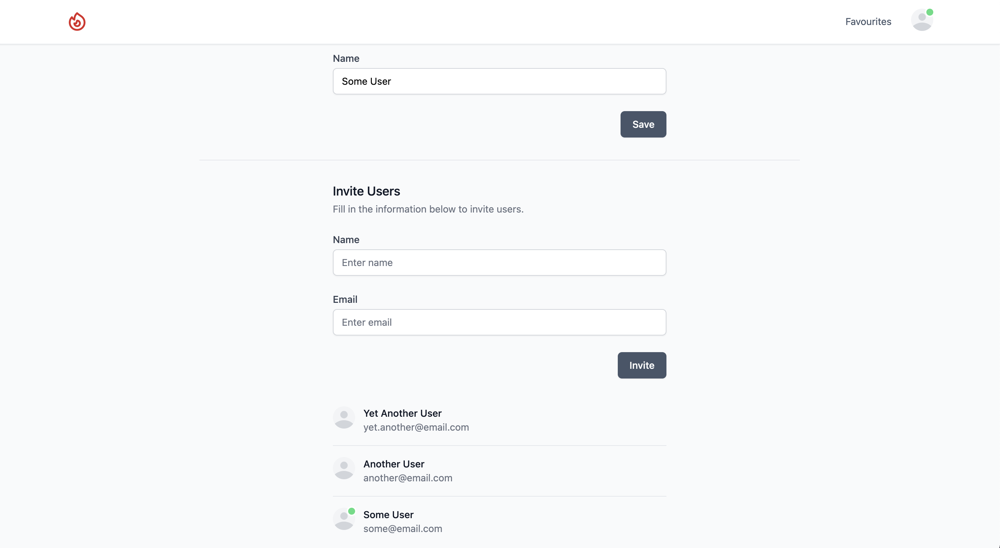

> **EARLY PREVIEW SOFTWARE** -
> Please beware this is early preview software in rapid development, there will be bugs!
>
> Please show your support by:
> * Using the software
> * Reporting bugs and issues
> * Being kind and patient with the development process
>
> Thank you and enjoy 🎉


<div align="center">
    <a href="https://github.com/midarrlabs/midarr-server/actions/workflows/master.yml"></a>
</div>

`Midarr` has arrived and aims to provide an experience like none other:

* Beautifully crafted interface to enhance your media viewing experience
* Social from the get go - user online and watch statuses
* User invitations to share the experience
* Integrations with Radarr and Sonarr
* and plenty more to come...


## Usage

Docker compose example:

```yaml
version: '3'

volumes:
  database-data:

services:
  midarr:
    image: ghcr.io/midarrlabs/midarr-server:latest
    depends_on:
      database:
        condition: service_healthy
    ports:
      - "4000:4000"
    volumes:
      - /path/to/radarr/movies:/movies
      - /path/to/sonarr/shows:/shows
    restart: unless-stopped

  database:
    image: bitnami/postgresql:14
    healthcheck:
      test: "exit 0"
    volumes:
      - database-data:/bitnami/postgresql
    ports:
      - 5432:5432
    environment:
      - POSTGRESQL_USERNAME=my_user
      - POSTGRESQL_PASSWORD=password123
      - POSTGRESQL_DATABASE=my_database
```

## Configuration

Integrations must also provide the volumes as mounted in your Radarr and Sonarr instances:
```bash
/path/to/radarr/movies:/movies
/path/to/sonarr/shows:/shows
```
This is so `Midarr` has the same reference to your media library as the integrations, and can find them.

## Gotchas

#### Media codec support
* Video H264
* Audio AAC / MP3
* Container MP4

#### Server setup

There is currently no initial server setup for walking through setting everything up, including the first user / admin account.

You must manually setup the first user account by inserting an entry into the postgres database, and setting the `is_admin` flag to `true`

Use https://bcrypt-generator.com/ to encrypt your password.

## Contributing

Thank you for your contributions! Big or small - we welcome all!

## License

`Midarr` is open-sourced software licensed under the [MIT license](LICENSE).

## Screenshots



